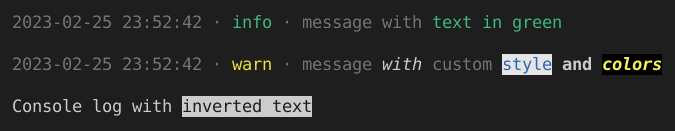

# Custom winston logger config

```
npm i Maks0u/logger
```

Import

```js
import logger, { bold, green } from 'logger';
```

Use logger and/or colorize functions

```js
import logger, { ColorCodes, colorize, bold, dim, inverse, green } from 'logger';

logger.info(`message with ${green('text in green')}`);

logger.warn(`message ${italic('with')} ${dim('custom')} ${colorize([ColorCodes.bgWhite, ColorCodes.blue], 'style')} ${bold('and')} ${colorize([ColorCodes.bgBlack, ColorCodes.yellow, ColorCodes.bold, ColorCodes.italic], 'colors')}`);

console.log(`Console log with ${inverse('inverted text')}`);
```


